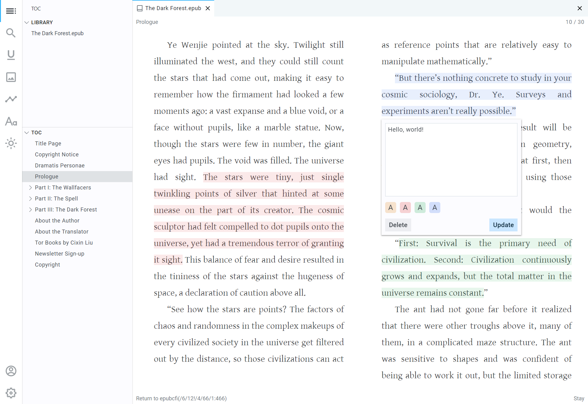

<h1 align="center"><a href="https://flowoss.com">Flow - Open Source Software (OSS)</a></h1>

<h2 align="center">Redefine ePub reader</h2>

<p align="center">Free. Open source. Now available as a browser extension!</p>

<p align="center">
</p>

## Features

- Grid layout
- Search in book
- Image preview
- Custom typography
- Highlight and Annotation
- Theme
- Data export
- Cloud storage

## Browser Extension

Flow is now available as a browser extension for both Google Chrome and Mozilla Firefox.

### Installation (from source)

To install the extension, you first need to build it from the source code.

1.  **Build for Chrome:**
    ```bash
    pnpm build:ext:chrome
    ```
2.  **Build for Firefox:**
    ```bash
    pnpm build:ext:firefox
    ```
    The built extension files will be located in the `apps/extension/dist` directory.

#### Loading in Chrome

1.  Open Google Chrome and navigate to `chrome://extensions`.
2.  Enable "Developer mode" using the toggle switch in the top-right corner.
3.  Click the "Load unpacked" button.
4.  In the file dialog, select the `apps/extension/dist` directory from this project.
5.  The "Flow" extension will now be installed.

#### Loading in Firefox

1.  Open Mozilla Firefox and navigate to `about:debugging`.
2.  Click on the "This Firefox" tab on the left.
3.  Click the "Load Temporary Add-on..." button.
4.  In the file dialog, navigate to the `apps/extension/dist` directory and select the `manifest.json` file.
5.  The "Flow" extension will now be temporarily installed.

## Development

### Prerequisites

- [Node.js](https://nodejs.org)
- [pnpm](https://pnpm.io/installation)
- [Git](https://git-scm.com/downloads)

### Clone the repo

```bash
git clone https://github.com/pacexy/flow
```

### Install the dependencies

```bash
pnpm i
```

### Setup the environment variables

Copy and rename all `.env.local.example`s to `.env.local` and setup the environment variables.

### Run the original Web App

```bash
pnpm dev
```

### Build the Extension

-   **For Chrome:**
    ```bash
    pnpm build:ext:chrome
    ```
-   **For Firefox:**
    ```bash
    pnpm build:ext:firefox
    ```

### Package the Extension for Distribution

-   **For Chrome:**
    ```bash
    pnpm package:chrome
    ```
    This will create a `flow-chrome.zip` file in the root directory.
-   **For Firefox:**
    ```bash
    pnpm package:firefox
    ```
    This will create a `flow-firefox.zip` file in the root directory.

## Contributing

There are many ways in which you can participate in this project, for example:

- [Submit bugs and feature requests](https://github.com/pacexy/flow/issues/new), and help us verify as they are checked in
- [Submit pull requests](https://github.com/pacexy/flow/pulls)

## Credits

- [Epub.js](https://github.com/futurepress/epub.js/)
- [React](https://github.com/facebook/react)
- [Next.js](https://nextjs.org/)
- [TypeScript](https://www.typescriptlang.org)
- [Vercel](https://vercel.com)
- [Turborepo](https://turbo.build/repo)
